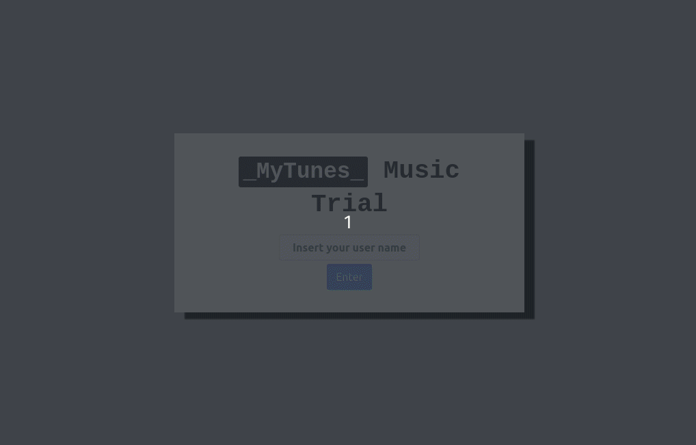

## How I created and deployed this app

1. npx create-react-app mytunes
2. npm install gh-pages --save-dev
3. npm install react-router-dom --save-dev
4. npm install bootstrap --save-dev
5. npm install reactstrap react react-dom
6. `package.json`:
	- "homepage": "https://Vincenzofdg.github.io/MyTunes",
	- "predeploy": "npm run build",
	- "deploy": "gh-pages -d build",
7. On index.js importe `BrowserRouter` and use as `<BrowserRouter basename={process.env.PUBLIC_URL}><BrowserRouter/>`

## Knowledges:

 - Component's life cicle;
 - React Router;
 - Fetch (Itunes API).

## Preview:

